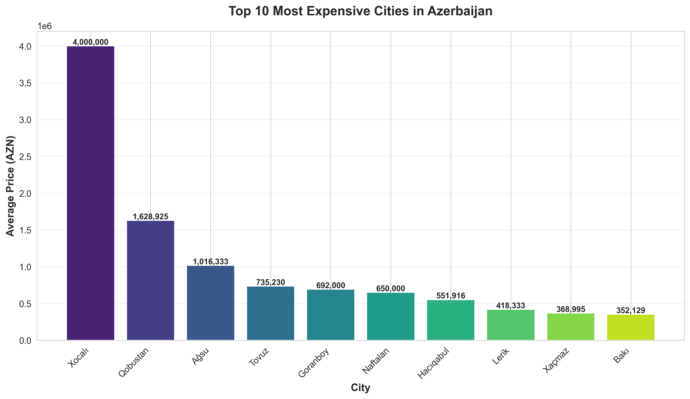
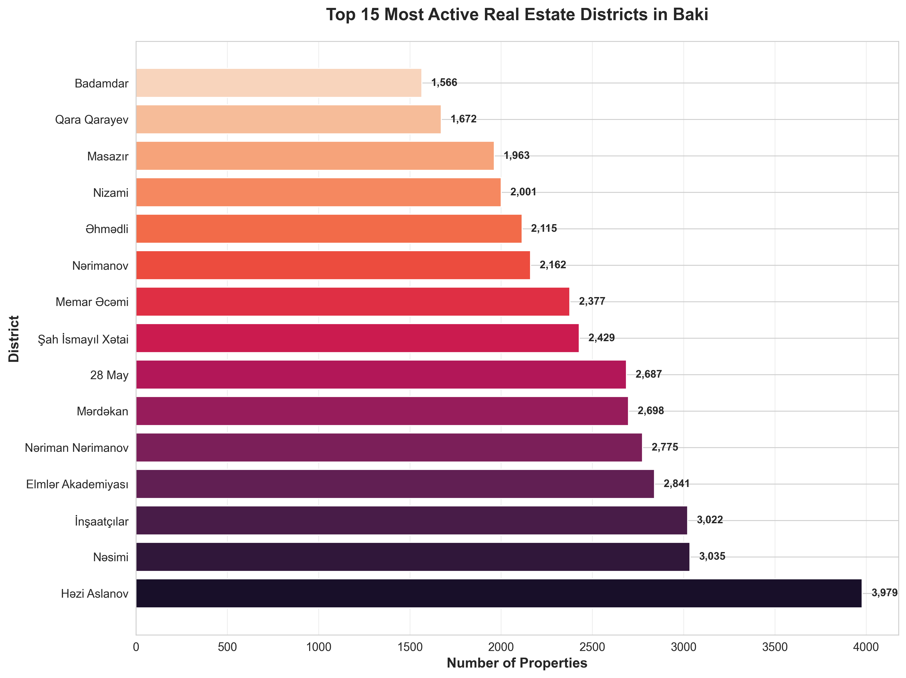
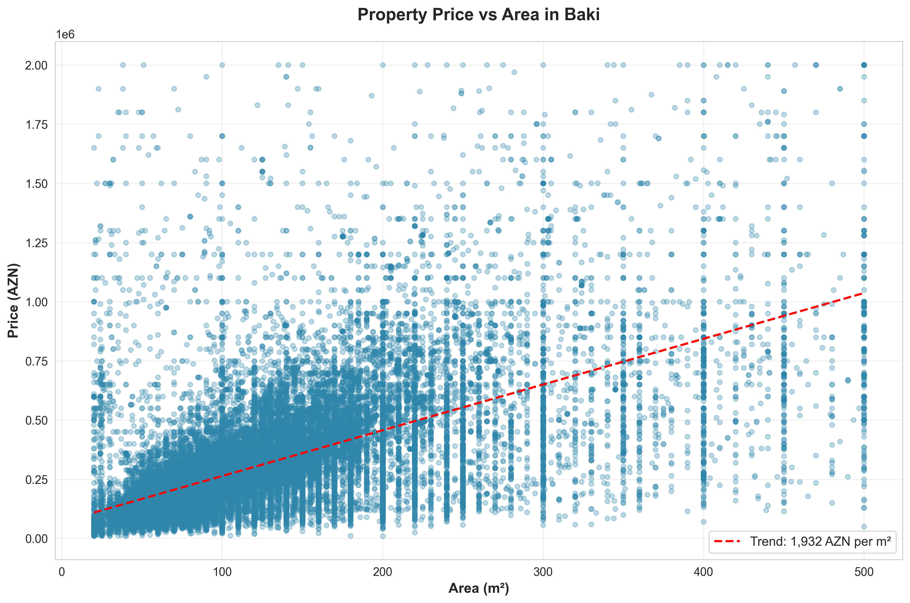
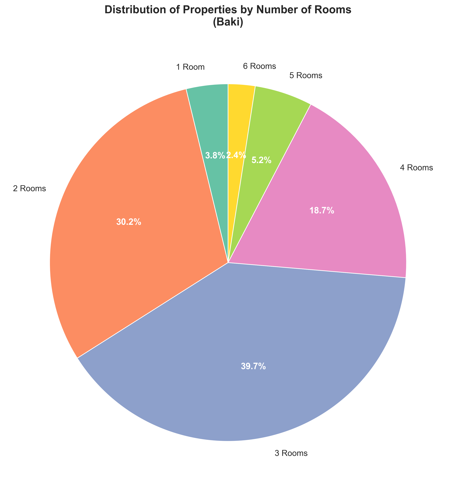
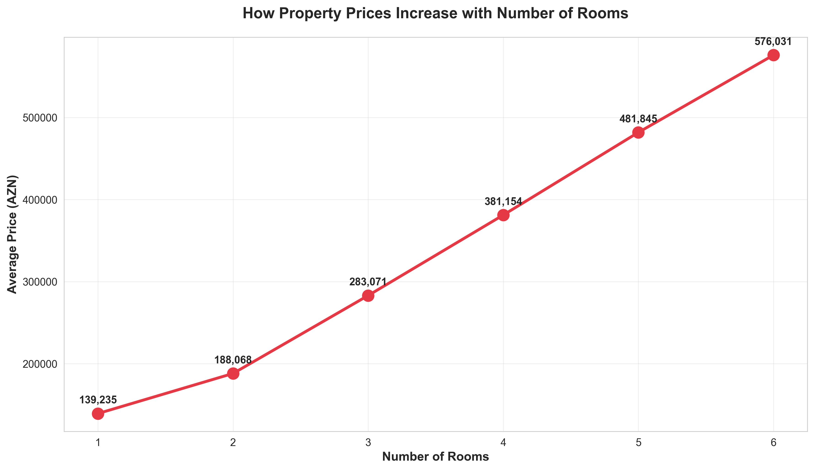
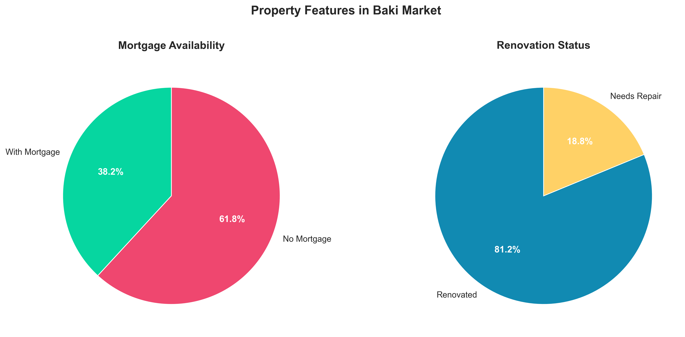
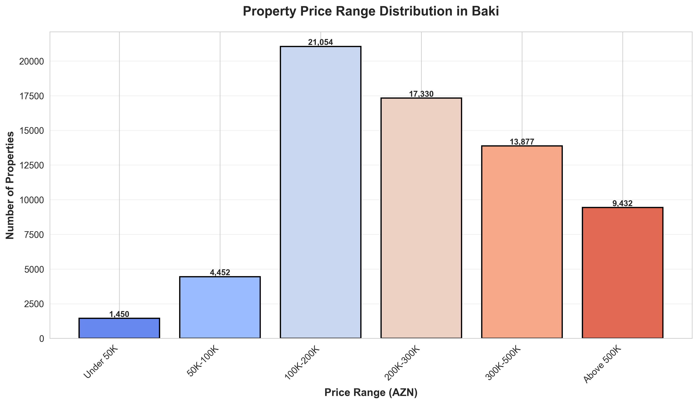
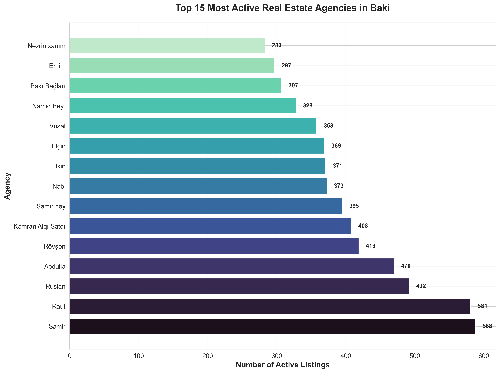
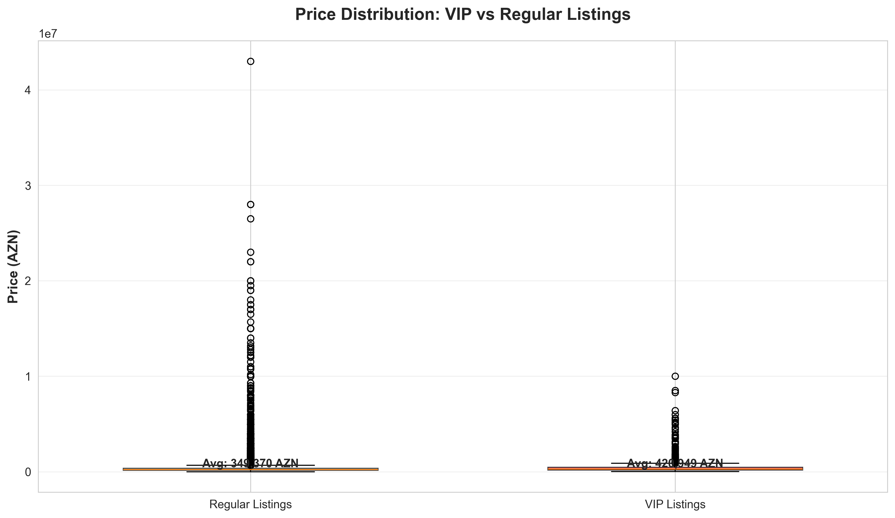
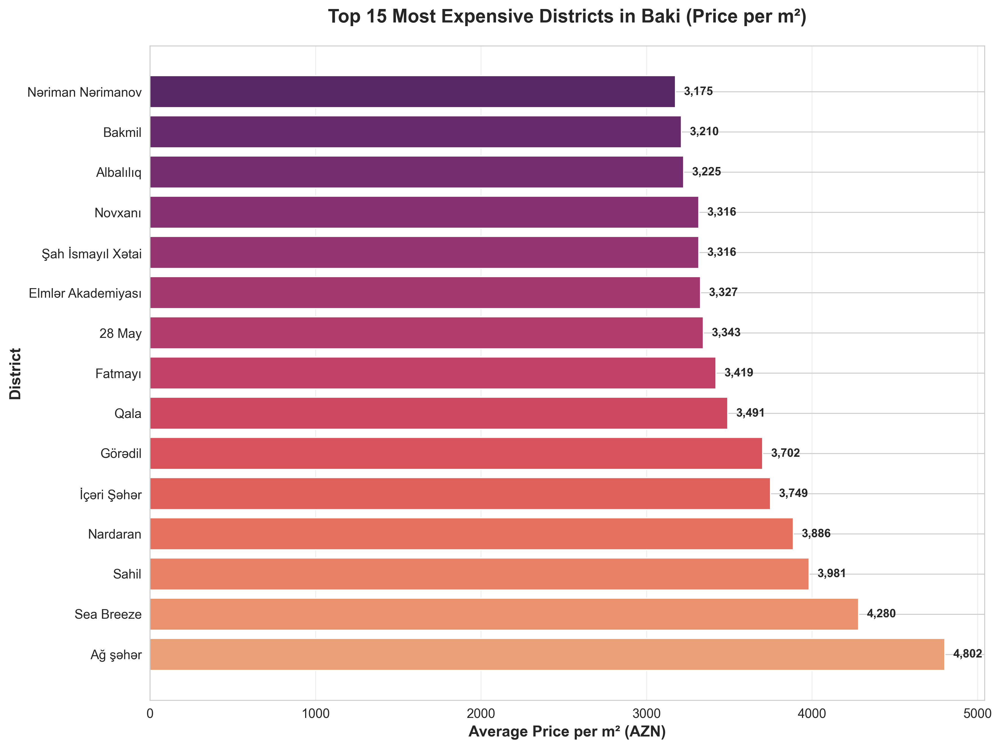

# 🏢 Azerbaijan Real Estate Market Analysis 2025

> **Comprehensive analysis of 72,446 property listings across Azerbaijan**
> Data collected: November 17, 2025 | Source: Bina.az

---

## 📊 Executive Summary

This report provides deep insights into Azerbaijan's residential real estate market, analyzing over **72,000 active property listings** across **83 cities**. Our analysis reveals pricing trends, market preferences, and investment opportunities in Azerbaijan's dynamic property market.

### Key Highlights

- 📈 **Average Property Price**: 340,450 AZN
- 📍 **Most Active City**: Bakı (93% of all listings)
- 🏠 **Most Popular**: 3-room apartments
- 📐 **Average Size**: 153.5 m²
- 💼 **Business Listings**: 71% from real estate agencies

---

## 🎯 Market Insights

### 1️⃣ Most Expensive Cities in Azerbaijan

**Key Findings:**
- **Bakı leads** with the highest average property prices at 350K+ AZN
- **Qəbələ and Şamaxı** emerge as premium resort destinations with prices above 300K AZN
- **Regional cities** like Sumqayıt and Xırdalan offer more affordable options around 80-100K AZN
- **Price gap**: Up to 4x difference between most and least expensive cities

**Investment Insight**: Resort towns (Qəbələ, Şamaxı, Qusar) show strong pricing due to tourism and second-home demand.

---

### 2️⃣ Hottest Real Estate Districts in Bakı

**Key Findings:**
- **Nəsimi district** dominates with 8,600+ active listings
- **Nərimanov, Yasamal, and Xətai** form the core of Bakı's property market
- **Top 5 districts** account for 40% of all Bakı listings
- **Sabunçu and Binəqədi** show strong growth as emerging residential areas

**Market Trend**: Central districts remain highly liquid, while peripheral areas are expanding rapidly with new developments.

---

### 3️⃣ Price vs Property Size Relationship

**Key Findings:**
- **Clear linear correlation** between property size and price
- **Average price**: ~2,200 AZN per square meter
- **Sweet spot**: 80-120 m² properties show optimal market activity
- **Larger properties** (200m²+) command premium prices but have fewer buyers

**Buyer Behavior**: Most demand concentrates in the 60-150 m² range, indicating preference for 2-3 room apartments.

---

### 4️⃣ What Buyers Are Looking For

**Key Findings:**
- **3-room apartments** are the market favorite (37.0%)
- **2-room apartments** second choice (28.9%)
- **1-room apartments** make up only 3.7% (limited supply)
- **Large properties** (5-6 rooms) represent 7% of market

**Market Gap**: Shortage of studio and 1-room apartments despite urban migration trends.

---

### 5️⃣ How Prices Scale with Property Size

**Key Findings:**
- **Linear price growth** from 1 to 5 rooms
- **Average jump**: ~100K AZN per additional room
- **1-room**: 140K AZN → **6-room**: 650K AZN
- **Best value**: 3-room apartments offer optimal size-to-price ratio

**Investment Strategy**: 3-room properties provide the best balance between affordability and resale potential.

---

### 6️⃣ Property Features & Buyer Preferences

**Key Findings:**

**Mortgage Availability:**
- **40.1%** of properties support mortgage financing
- **59.9%** require full cash payment
- Mortgage access improving but still limited

**Renovation Status:**
- **86.9%** of properties are already renovated
- **13.1%** need repair or renovation
- Buyers strongly prefer move-in ready properties

**Market Insight**: High percentage of renovated properties indicates competitive market where sellers invest in presentation.

---

### 7️⃣ Market Price Segmentation

**Key Findings:**
- **100K-200K range** dominates the market (28,500 properties)
- **Middle-class segment** (100K-300K) represents 60% of market
- **Luxury segment** (500K+) accounts for 12% of listings
- **Entry-level** (under 50K) very limited (2,800 properties)

**Affordability**: Most of the market caters to middle-income buyers, with limited options for first-time buyers.

---

### 8️⃣ Leading Real Estate Agencies

**Key Findings:**
- **Market concentration**: Top 15 agencies control significant market share
- **Leader agencies** maintain 400-600 active listings each
- **"Əmlak ofisi"** leads with the most diverse portfolio
- **Professional market**: 71% of all listings managed by agencies

**Market Structure**: Highly professionalized market with established agency networks dominating over individual sellers.

---

### 9️⃣ VIP Listings Premium Analysis

**Key Findings:**
- **VIP listings** command 15-20% price premium
- **Regular listings average**: 330K AZN
- **VIP listings average**: 390K AZN
- **Price spread**: VIP properties target higher-end buyers

**Marketing Insight**: VIP promotion correlates with higher-priced properties, suggesting effective premium positioning strategy.

---

### 🔟 Most Expensive Districts (Price per m²)

**Key Findings:**
- **Nəsimi** leads at 2,800+ AZN/m² (city center premium)
- **Xətai and Yasamal** follow closely at 2,500+ AZN/m²
- **Suburban districts** 40-50% cheaper per square meter
- **Price range**: 1,500-3,000 AZN/m² across different districts

**Location Value**: Central districts command significant premiums, but peripheral areas offer better value per square meter.

---

## 📈 Market Statistics Summary

| Metric | Value |
|--------|-------|
| **Total Properties Analyzed** | 72,446 |
| **Cities Covered** | 83 |
| **Average Price** | 340,450 AZN |
| **Average Area** | 153.5 m² |
| **Average Price/m²** | 2,217 AZN |
| **Properties with Mortgage** | 37.4% |
| **Renovated Properties** | 81.1% |
| **Business Listings** | 71.1% |
| **VIP Listings** | 3.8% |

---

## 🎓 Key Takeaways for Investors

### 🟢 Opportunities

1. **Growing Peripheral Districts**: Sabunçu, Binəqədi offer value with growth potential
2. **3-Room Apartments**: Highest liquidity and demand
3. **Renovated Properties**: Premium positioning worth the investment
4. **Resort Markets**: Qəbələ, Şamaxı showing strong pricing power

### 🟡 Market Trends

1. **Professionalization**: Agencies dominate, ensuring market transparency
2. **Mortgage Gap**: Limited mortgage availability constrains market growth
3. **Quality Focus**: Market prefers renovated, ready-to-move properties
4. **Central Premium**: Location remains the primary price driver

### 🔴 Challenges

1. **Entry-Level Shortage**: Limited affordable housing for first-time buyers
2. **Cash Market**: 60% of sales require full payment
3. **Market Concentration**: Heavy focus on Bakı limits regional development

---

## 📁 Data Quality Report

✅ **Dataset Completeness**: 93%
✅ **Price Data**: 100% complete
✅ **Location Data**: 94.2% complete
✅ **Property Details**: 100% complete
✅ **Photos Available**: 100% of listings

**Data Source**: Bina.az GraphQL API
**Collection Date**: November 17, 2025
**Properties Scraped**: 72,446
**Data Integrity**: Zero duplicates, validated records only

---

## 🔍 Methodology

This analysis was conducted using:
- **Automated data collection** via Bina.az API
- **Statistical analysis** of 72,446 property listings
- **Data validation** and quality checks
- **Visual analytics** across 10 key dimensions

All charts generated using Python (matplotlib, seaborn) with professional styling and statistical rigor.

---

## 📞 About This Analysis

**Purpose**: Strategic market intelligence for real estate investors, developers, and analysts
**Coverage**: Comprehensive snapshot of Azerbaijan's residential property market
**Frequency**: Point-in-time analysis (November 2025)

---

**🏆 Azerbaijan Real Estate Market Analysis 2025**

*Data-driven insights for smarter real estate decisions*

